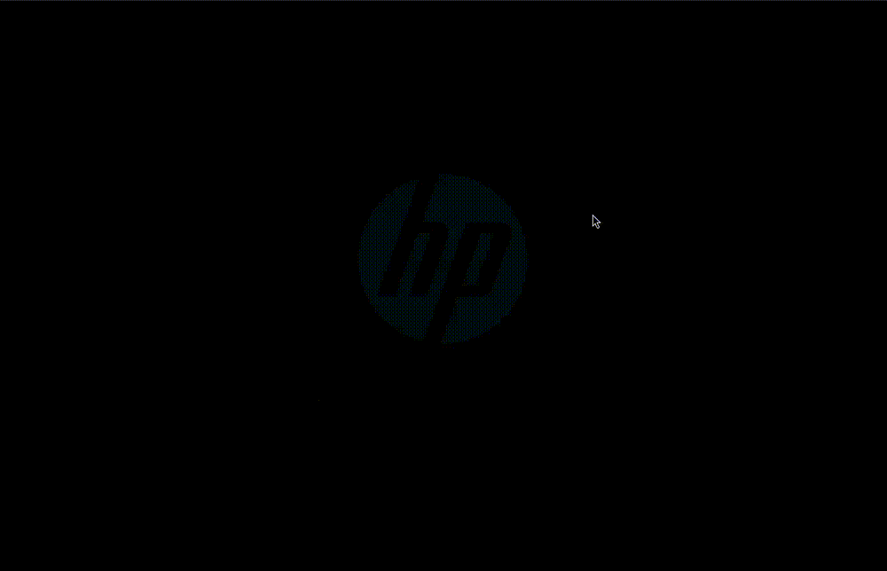

# webshell

DragonHack URL challenge - (almost) full UNIX machine emulator on the web.<br>
Deployed at [dragonhack.lol](https://dragonhack.lol/)



## Commands
- `help` - Show all available commands
- `man` - Show manual for a command
- `ls` - List directory contents
- `cd` - Change directory
- `pwd` - Print working directory
- `cat` - Display file contents
- `whoami` - Display current user
- `touch` - Create a new file
- `mkdir` - Create a new directory
- `rm` - Remove a file
- `rmdir` - Remove a directory
- `cp` - Copy a file
- `mv` - Move/rename a file
- `echo` - Print text to terminal
- `clear` - Clear the terminal
- `uptime` - Show system uptime
- `theme` - Switch between light/dark theme
- `git` - Show repo commits and branches
- `dragon` - Draw ASCII art of a dragon
- `sudo` - Try it and find out...

## Deploy
Deployed on Cloudflare pages:
```
npx wrangler login
npx wrangler pages deploy . --project-name=webshell
```